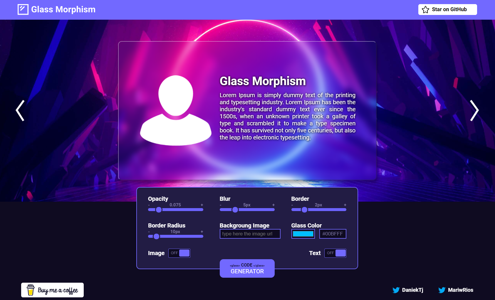

# Glass Morphism Generator
Glass Morphism es un generador que provee el código CSS necesario para replicar el efecto de vidrió que sea ha vuelto tendencia estos últimos meses dentro de la comunidad desarrolladora.

Nos dimos cuenta de que actualmente solo existía un generador para Glass Morphism, sin embargo no da las suficientes herramientas de personalizacion necesarias para satisfacer los gustos y necesidades que se requieren según el caso con el que hará contraste, es por ello que nació la idea de aportar algo a la comunidad dev y seguir con nuestras practicas en este camino del Frontend.

## Características Personalizables:
- Color.
- Transparencia.
- Desenfoque.
- Grosor y el radio de los bordes.

